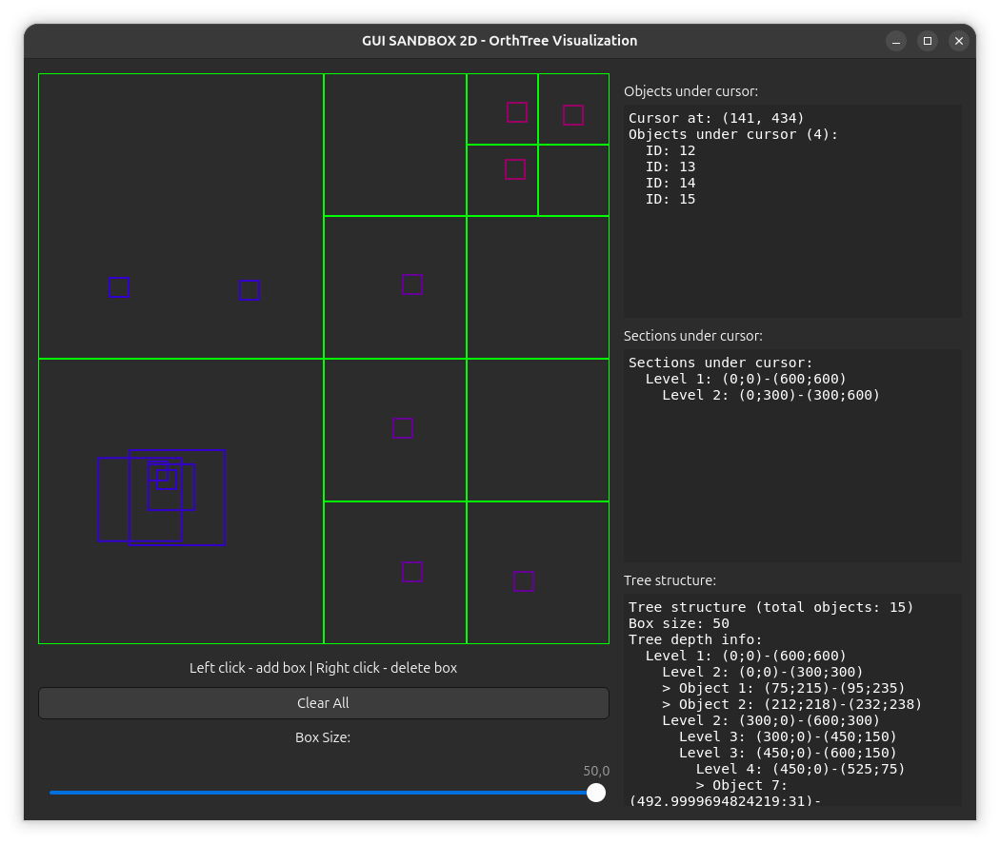

# 🌳 ORTHTREE - Orthogonal Tree Library

## 📖 Description

This project is a header-only C++23 library for working with orthtrees - a powerful spatial indexing data structure that generalizes quadtrees and octrees to arbitrary dimensions!

🎯 Orthtrees Defined: From [CGAL](https://doc.cgal.org/latest/Orthtree/index.html) documentation:

> Quadtrees are tree data structures in which each node encloses a rectangular section of space, and each internal node has exactly 4 children. Octrees are a similar data structure in 3D in which each node encloses a rectangular cuboid section of space, and each internal node has exactly 8 children.

> We call the generalization of such data structure "orthtrees", as orthants are generalizations of quadrants and octants. The term "hyperoctree" can also be found in literature to name such data structures in dimensions 4 and higher.

## ✨ Key Features

 - 🚀 Header-only - Just include and use!
 - 📏 N-dimensional - Works in 1D, 2D, 3D, and beyond
 - ⚡ High Performance - Efficient spatial queries and operations
 - 🛡️ Type Safe - Built with C++ concepts and templates
 - 🔧 Configurable - Customize node capacity, coordinate types, and sharing behavior
 - 🐛 Debug Friendly - Extensive assertions for development
 - 📊 Traversal Support - Iterate through tree structure for visualization or analysis

## 🚀 Quick Start

### Installation

Since this is a header-only library, simply copy the headers to your project or include the directory in your build system.

### Basic Usage

```cpp
#include <orthtree.h>

int main() {
    // Define a 2D tree with float coordinates storing integer values
    using Tree_t = orthtree::Tree<int, float, 2>;
    using Box_t = Tree_t::Box_t;
    
    // Create a tree covering rectangle: (-5,-6) to (11,7)
    Tree_t tree{Box_t{{-5.0, -6.0}, {11.0, 7.0}}};
    
    // Add objects with their bounding boxes
    tree.Add(1, Box_t{{1.0, 1.0}, {2.0, 2.0}});   // Object 1
    tree.Add(2, Box_t{{10.0, 10.0}, {20.0, 20.0}}); // Object 2
    tree.Add(3, Box_t{{0.5, 0.5}, {1.5, 1.5}});   // Overlapping with object 1
    
    // Find all intersections with a query box
    auto box_intersections = tree.FindIntersected(Box_t{{-10.0, -1.0}, {1.0, 10.0}});
    
    // Find all pairwise intersections in the tree
    auto all_intersections = tree.FindIntersected();
    
    // Check if an object exists
    if (tree.Contains(1)) {
        // Get its bounding box
        auto box = tree.GetBox(1);
    }
    
    // Remove an object
    tree.Del(2);
    
    return 0;
}
```

## 📸 Working Examples

A working example can be found in the _examples_ directory.

### gui_sandbox_2d

<div align="center">
  
  <br>
  <em>Graphical interface for 2D orthtree visualization with interactive control</em>
</div>

📋 Interface Capabilities

- ✅ Interactive object addition/removal
- ✅ Spatial partitioning structure visualization
- ✅ Object and section tracking under cursor
- ✅ Real-time parameter adjustment
- ✅ Automatic tree updates

🎮 Controls

| Action       | Result             |
|--------------|--------------------|
| Left Click   | Add object         |
| Right Click  | Remove object      |
| Slider       | Change object size |
| Clear Button | Clear entire tree  |

## 🔧 Build Configuration

### Debug Assertions

The library includes runtime debug assertions that can be controlled:

| Configuration         | Behavior                       |
|-----------------------|--------------------------------|
| Default debug build   | Assertions enabled             |
| Default release build | Assertions disabled            |
| Custom override       | Define `ORTHTREE_DEBUG_CHECKS` |

Example: Force enable in release:

```cpp
#define ORTHTREE_DEBUG_CHECKS 1
#include <orthtree.h>
```

Using CMake:

```cmake
target_compile_definitions(myapp PRIVATE ORTHTREE_DEBUG_CHECKS=1)
```

## 🐋 Docker Compose Development Workflow

### 📋 Overview

This project uses Docker Compose to provide a consistent development environment for building, testing, and analyzing the C++ codebase. 
All development tasks can be performed through standardized Docker commands, ensuring consistent results across different machines.

**⚠️ Important Warning! Always execute commands from the project's root directory to ensure proper path resolution.**

### 🚀 Available Commands

🔨 Build the Project
```bash
docker compose -f scripts/docker/docker-compose.yml run --rm orthtree-linux-build
```

🧪 Run Tests
```bash
docker compose -f scripts/docker/docker-compose.yml run --rm orthtree-linux-test
```

🎨 Check Code Formatting
```bash
docker compose -f scripts/docker/docker-compose.yml run --rm orthtree-linux-format
```

🔍 Static Code Analysis
```bash
docker compose -f scripts/docker/docker-compose.yml run --rm orthtree-linux-tidy
```

## 🔧 Advanced Configuration

### Template Parameters

```cpp
// Full control over tree behavior:
orthtree::Tree<
    ObjectType,     // 🔸 Type of objects to store (must be hashable)
    float,          // 🔸 Coordinate type (float, double, etc.)
    3,              // 🔸 Dimensions (2 for quadtree, 3 for octree, etc.)
    16,             // 🔸 Max objects per node before splitting
    false           // 🔸 Allow objects to belong to multiple nodes (experimental)
> tree(bounding_box);

Working with Custom Types
cpp

struct GameObject {
    int id;
    std::string name;
    // ... other fields
};

// Provide hash and equality for custom types
namespace std {
    template<> struct hash<GameObject> {
        size_t operator()(const GameObject& obj) const {
            return hash<int>()(obj.id);
        }
    };
}

// Create tree for custom type
using GameTree = orthtree::Tree<GameObject, float, 2>;
```

## 📊 API Reference

### Core Operations

| Method             | Description                    | Complexity |
|--------------------|--------------------------------|------------|
| Add(value, box)    | Insert value with bounding box | O(log N)   |
| Del(value)         | Remove value from tree         | O(log N)   |
| Change(value, box) | Update value's bounding box    | O(log N)   |
| Contains(value)    | Check if value exists          | O(1)       |
| GetBox(value)      | Get value's bounding box       | O(1)       |

### Query Operations

| Method                 | Description                        | Use Case            |
|------------------------|------------------------------------|---------------------|
| FindIntersected()      | All intersecting pairs             | Collision detection |
| FindIntersected(box)   | Values intersecting query box      | Range queries       |
| FindIntersected(value) | Values intersecting specific value | Proximity detection |

## 🎮 Real-World Applications

 - 🎯 Collision Detection in Games
 - 🗺️ Geographic Information Systems
 - 🔬 Scientific Computing

## 🔮 Future Roadmap

 - ⚡ Optimized Change() operation to avoid remove/add
 - 📦 Serialization/deserialization support
 - 🧵 Thread-safe operations
 - 📈 Statistics collection (tree depth, balance, etc.)


## 🤝 Contributing

We welcome contributions! Please:

 - 🍴 Fork the repository
 - 🌿 Create a feature branch
 - ✅ Add tests for new functionality
 - 📝 Update documentation
 - 🔧 Submit a pull request

## 📄 License

MIT License - see LICENSE file for details.
